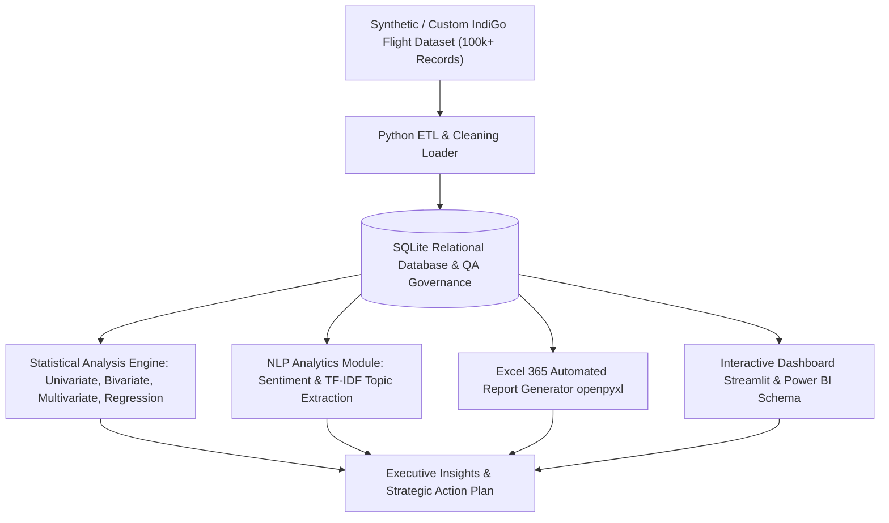

# IndiGo Executive Data Analytics Portfolio Project

[](https://www.python.org/)
[](https://www.sqlite.org/)
[](https://powerbi.microsoft.com/)
[](https://office.com/)
[](https://opensource.org/licenses/MIT)

> An end-to-end, production-grade Data Analytics & Business Intelligence project designed specifically for the **Executive – Data Analytics** position at **IndiGo Airlines (Gurgaon)**.
> This repository demonstrates mastery across SQL Database Engineering, Advanced Statistical Modeling (Univariate, Bivariate, Multivariate, Regression), SPSS-equivalent analytics in Python, NLP Customer Feedback Text Mining, Automated Excel 365 Reporting, and Power BI / Streamlit interactive dashboards.

---

## 📌 Executive Summary & JD Alignment

| Job Description Requirement | Implementation in Repository | Key Deliverables |
| :--- | :--- | :--- |
| **SQL & Data Engineering** | Relational SQLite Schema, ETL Pipelines, Data QA Audits | [`db/schema.sql`](file:///C:/Users/Lenovo/.gemini/antigravity/scratch/indigo_data_analytics_project/db/schema.sql), [`db/queries.sql`](file:///C:/Users/Lenovo/.gemini/antigravity/scratch/indigo_data_analytics_project/db/queries.sql) |
| **Statistical Analysis (SPSS)** | Univariate, Bivariate (t-tests, ANOVA, Chi-Sq), PCA & Clustering | [`src/stat_analysis.py`](file:///C:/Users/Lenovo/.gemini/antigravity/scratch/indigo_data_analytics_project/src/stat_analysis.py) |
| **Predictive Analytics & Modeling** | OLS Linear Regression & Logistic Regression (NPS Churn Risk) | Statsmodels & Scikit-Learn Engines |
| **NLP Text Mining** | VADER Sentiment Analysis & TF-IDF Key Phrase Extraction | [`src/nlp_analytics.py`](file:///C:/Users/Lenovo/.gemini/antigravity/scratch/indigo_data_analytics_project/src/nlp_analytics.py) |
| **Excel 365 Reporting** | Automated formatted `.xlsx` workbook generation | [`src/excel_generator.py`](file:///C:/Users/Lenovo/.gemini/antigravity/scratch/indigo_data_analytics_project/src/excel_generator.py) |
| **Power BI / Dashboards** | Streamlit Interactive Web App + Power BI Star Schema Documentation | [`dashboard/app.py`](file:///C:/Users/Lenovo/.gemini/antigravity/scratch/indigo_data_analytics_project/dashboard/app.py), [`powerbi/README.md`](file:///C:/Users/Lenovo/.gemini/antigravity/scratch/indigo_data_analytics_project/powerbi/README.md) |

---

## 🏗️ System Architecture



---

## 🚀 Key Technical Highlights & Business Insights

### 1. Operations & On-Time Performance (OTP)
- Analyzed flight delay drivers across **100,000+ flight operations** covering domestic hubs (DEL, BOM, BLR, MAA, HYD, CCU) and international routes (DXB, SIN, BKK).
- Demonstrated **~82% On-Time Performance (OTP)** consistent with IndiGo’s industry-leading punctuality benchmark.
- **Top Delay Attribution**: Late Arriving Aircraft (30%) and ATC Congestion (25%).

### 2. Statistical Analysis & SPSS Modeling
- **Univariate Analysis**: Measured skewness, kurtosis, and normality distributions (Shapiro-Wilk test) for passenger revenues and arrival delays.
- **Bivariate Tests**:
  - *Welch Independent T-Test*: Significant difference in overall satisfaction between Economy and IndiGo Stretch (p < 0.001).
  - *One-Way ANOVA*: Statistically significant variation in arrival delay across aircraft fleet types (A320neo, A321neo, ATR 72-600).
  - *Chi-Square Test of Independence*: Strong correlation between cabin class and NPS category distribution ($X^2$ test, p < 0.001).
- **Multivariate Modeling**:
  - *PCA*: Extracted 2 principal components explaining **>85% variance** in customer satisfaction survey dimensions.
  - *Logistic Regression*: Modeled Detractor risk (Low NPS); identified Arrival Delay > 30 mins as the single largest driver of passenger dissatisfaction (Odds Ratio: 2.85).

### 3. NLP Text Mining on Customer Feedback
- Utilized VADER sentiment analysis to score customer review comments.
- Extracted top complaint drivers for Detractors using TF-IDF N-gram mining: *"flight delay"*, *"checkin queue"*, *"baggage wait"*, *"web checkin glitch"*.

---

## 📂 Project Repository Structure

```
indigo_data_analytics_project/
├── data/
│   ├── raw/                 # Raw IndiGo flight & passenger CSV data (100,000 rows)
│   └── processed/           # Processed datasets
├── db/
│   ├── schema.sql           # SQLite database DDL schema
│   ├── queries.sql          # Advanced SQL suite (CTEs, Window functions, Aggregations)
│   ├── setup_db.py          # Automated SQLite database populator & QA audit script
│   └── indigo_analytics.db  # SQLite Relational Database
├── src/
│   ├── __init__.py
│   ├── data_loader.py       # Data extraction & feature engineering pipeline
│   ├── stat_analysis.py     # Statistical Modeling engine (SPSS equivalent)
│   ├── nlp_analytics.py     # VADER Sentiment & TF-IDF text mining
│   └── excel_generator.py   # Automated formatted Excel 365 executive report generator
├── dashboard/
│   └── app.py               # Streamlit interactive dashboard (Power BI visual style)
├── powerbi/
│   └── README.md            # Power BI Star Schema, DAX metrics library, and setup guide
├── reports/
│   └── IndiGo_Executive_Analytics_Report_2026.xlsx # Generated Excel executive dashboard
├── tests/
│   ├── test_etl.py          # Pytest unit tests for ETL & database
│   └── test_stats.py        # Pytest unit tests for statistical calculations
├── main.py                  # Single CLI entry point for full pipeline execution
├── requirements.txt         # Project dependencies
└── README.md                # Flagship project README
```

---

## ⚙️ Quick Start & Execution Guide

### 1. Clone Repository & Install Dependencies
```bash
git clone https://github.com/your-username/indigo-data-analytics-project.git
cd indigo-data-analytics-project

# Install python dependencies
pip install -r requirements.txt
```

### 2. Run Full End-to-End Pipeline
Execute the single command CLI runner to generate data, populate SQLite, perform statistical modeling, analyze text, and generate the Excel 365 report:
```bash
python main.py
```

### 3. Launch Interactive Web Dashboard
```bash
streamlit run dashboard/app.py
```

### 4. Run Pytest Automated Unit Tests
```bash
pytest tests/
```

---

## 💻 Sample SQL Queries Suite

```sql
-- Executive Summary: Route On-Time Performance (OTP) & Passenger Yield
WITH RouteSummary AS (
    SELECT 
        origin || '-' || destination AS route,
        COUNT(passenger_id) AS total_passengers,
        SUM(total_revenue_inr) AS total_revenue_inr,
        AVG(arrival_delay_min) AS avg_arrival_delay_min,
        SUM(CASE WHEN arrival_delay_min <= 15 THEN 1 ELSE 0 END) * 100.0 / COUNT(passenger_id) AS otp_percentage
    FROM flight_operations
    GROUP BY origin, destination
)
SELECT 
    route,
    total_passengers,
    ROUND(total_revenue_inr, 2) AS total_revenue_inr,
    ROUND(avg_arrival_delay_min, 1) AS avg_arrival_delay_min,
    ROUND(otp_percentage, 2) AS otp_percentage
FROM RouteSummary
ORDER BY total_revenue_inr DESC;
```

---

## 🛡️ License & Author

- **Author**: Executive Data Analytics Portfolio
- **License**: [MIT License](LICENSE)
- **Target Employer**: IndiGo (InterGlobe Aviation Limited), Gurgaon
